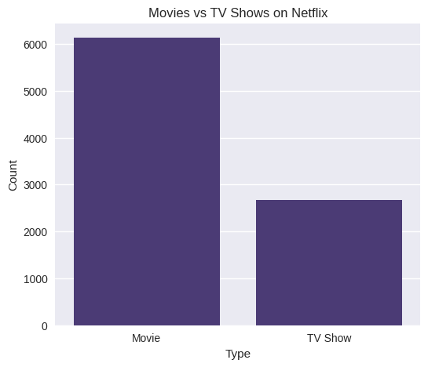
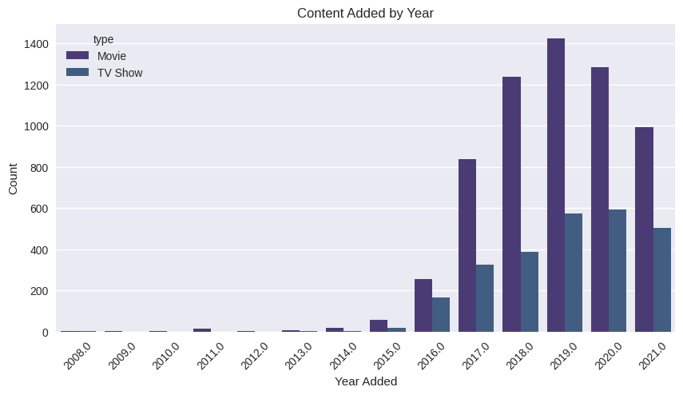
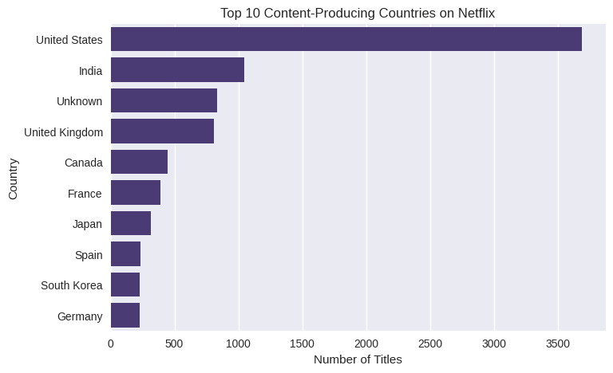
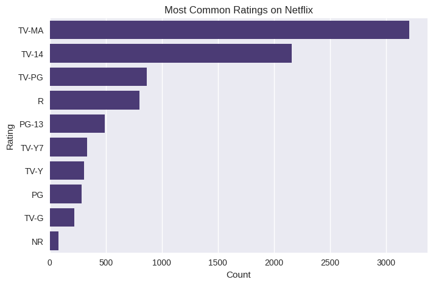
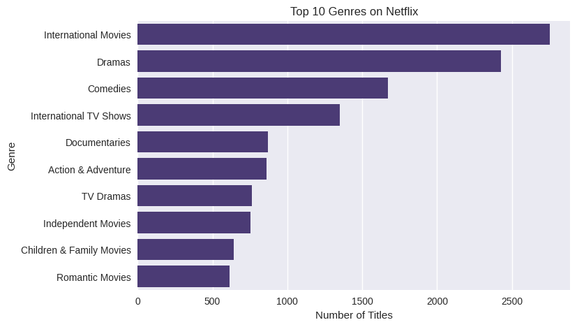

# 🎬 Netflix Data Analysis (EDA)

## 📘 Overview
This project performs an **Exploratory Data Analysis (EDA)** on the **Netflix Movies and TV Shows** dataset to uncover trends and insights about Netflix's global catalog.  
It includes data cleaning, feature extraction, and visualization using Python libraries such as **Pandas**, **Matplotlib**, and **Seaborn**.

---

## 🎯 Objectives
- Understand the distribution of **Movies vs TV Shows**  
- Explore how Netflix’s content has evolved over the years  
- Identify **top content-producing countries**  
- Analyze **ratings** and **popular genres**  
- Prepare a clean dataset for future modeling tasks  

---

## 📊 Dataset
**Source:** [Netflix Movies and TV Shows on Kaggle](https://www.kaggle.com/datasets/shivamb/netflix-shows)  
**File Used:** `netflix_titles.csv`

**Columns Overview:**
| Column | Description |
|--------|-------------|
| show_id | Unique ID for each show |
| type | Movie or TV Show |
| title | Title of the content |
| director | Director of the show |
| cast | Main cast members |
| country | Country of origin |
| date_added | Date the show was added to Netflix |
| release_year | Original release year |
| rating | Age rating |
| duration | Duration (minutes or seasons) |
| listed_in | Genre |
| description | Summary of the show |

---

## 🧰 Tools & Libraries
- **Python**
- **Pandas** – Data manipulation  
- **NumPy** – Numerical operations  
- **Matplotlib & Seaborn** – Data visualization  
- **Google Colab / Jupyter Notebook** – Development environment  

---

## 🧹 Data Cleaning Steps
1. Checked for and filled missing values (`country`, `director`, `cast`, `rating`)  
2. Removed duplicates  
3. Converted `date_added` to datetime format  
4. Extracted `year_added` for trend analysis  

---

## 📈 Visualizations
1. **Movies vs TV Shows**  
   

2. **Content Added by Year**  
   

3. **Top 10 Content-Producing Countries**  
   

4. **Most Common Ratings**  
   

5. **Top 10 Genres**  
   

---

## 💡 Key Insights
- Around **70%** of Netflix content are **Movies**.  
- The number of **TV Shows** added has increased in recent years.  
- The **USA** and **India** dominate Netflix’s content production.  
- Most common rating is **TV-MA**, followed by **TV-14**.  
- Popular genres include **International Movies**, **Dramas**, and **Comedies**.

---

## 💾 Output Files
- `Netflix_EDA.ipynb` – Jupyter/Colab notebook  
- `netflix_titles_cleaned.csv` – Cleaned dataset  
- `movies_vs_tvshows.png`, `content_added_by_year.png`, etc. – Generated plots  

---

## 🚀 How to Run
1. Clone the repository  
   ```bash
   git clone https://github.com/yourusername/Project_1_Netflix_EDA.git
   cd Project_1_Netflix_EDA
