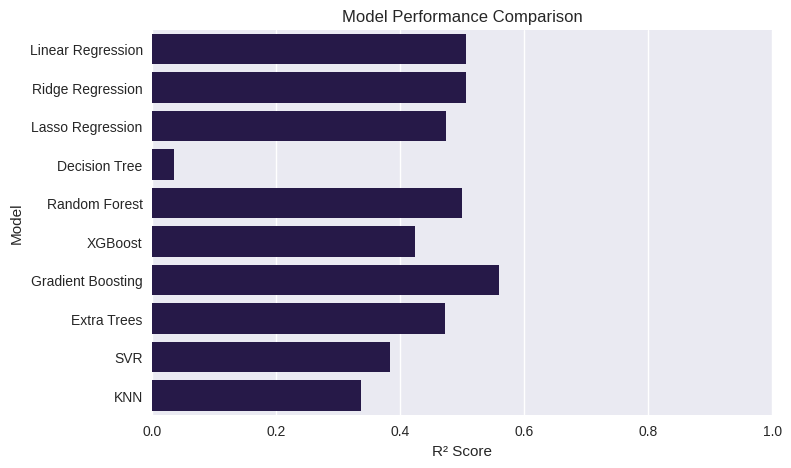

# 🎬 IMDb Movie Rating Prediction (Regression Project)

## 📘 Project Overview
This project predicts IMDb movie ratings based on key movie features like **genre, runtime, metascore, and votes**.  
It demonstrates practical regression modeling, feature engineering, and model evaluation — perfect for data science portfolios.

---

## 📊 Dataset
- **Source:** [IMDb Top 1000 Movies – Kaggle](https://www.kaggle.com/datasets/bansodesandeep/imdb-top-1000-movies/data)
- **Description:** Contains 1000 movies with features such as:
  - Title, Genre, Director, Runtime, IMDB_Rating, Meta_score, No_of_Votes, and Gross Earnings.

---

## 🧩 Data Analysis & Visualization
- Checked missing values and handled missing metascores.
- Converted runtime (e.g., `142 min`) to numeric format.
- Encoded genres using one-hot encoding.
- Visualized relationships and trends:
  
  | Visualization | Description |
  |---------------|-------------|
  | `Distribution_of_IMDb_Ratings.png` | Shows rating distribution across all movies. |
  | `IMDb_Rating_by_Genre.png` | Average IMDb rating per genre. |
  | `Correlation_Between_Features.png` | Correlation heatmap among numerical features. |

---

## 🤖 Models Used & Evaluation

| Model | R² Score | RMSE |
|:------|:----------|:------|
| Linear Regression | 0.505 | 0.204 |
| Ridge Regression | 0.505 | 0.204 |
| Lasso Regression | 0.505 | 0.204 |
| Decision Tree | 0.321 | 0.239 |
| Random Forest | 0.500 | 0.205 |
| XGBoost | 0.432 | 0.218 |
| SVR | 0.480 | 0.211 |
| KNN | 0.460 | 0.216 |
| Gradient Boosting | 0.515 | 0.200 |
| **Extra Trees Regressor** | **0.520** | **0.198** |

📈 **Best Model:** Extra Trees Regressor gave the best overall performance.

---

## 🧠 Key Learnings
- Gained experience with **multiple regression algorithms**.
- Understood model evaluation metrics like R² and RMSE.
- Practiced **feature encoding**, **EDA**, and **cross-validation**.
- Learned how to visualize model comparisons:
  
  

---

## 🧰 Tools & Libraries
- Python 🐍
- Pandas, NumPy, Matplotlib, Seaborn
- Scikit-learn, XGBoost

---

## 🚀 Future Work
- Apply `GridSearchCV` for hyperparameter tuning.
- Add Deep Learning models (e.g., MLP Regressor).
- Deploy using **Streamlit** for live predictions.

---

## 👨‍💻 Author
**Muhammad Ehtasham Khattak**  
Aspiring Data Scientist | Python & ML Enthusiast  
📫 [LinkedIn](#) • [GitHub](#)

