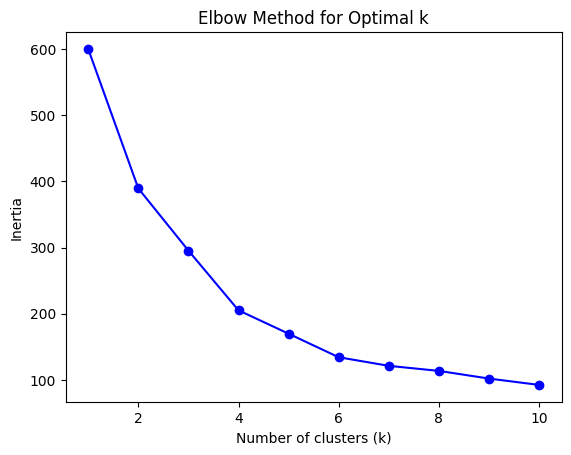
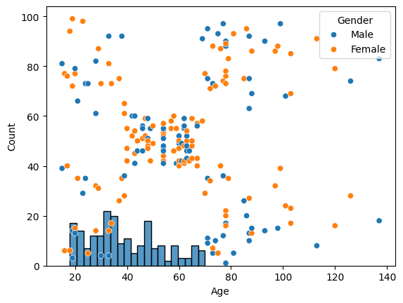
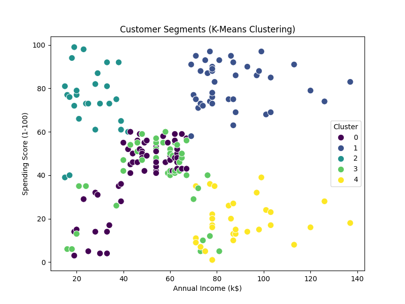

# 🛍️ Customer Segmentation using K-Means Clustering

## 📘 Overview
This project applies **K-Means clustering** to segment mall customers based on their **Age**, **Annual Income**, and **Spending Score**.  
The goal is to identify distinct customer groups for targeted marketing strategies and improved business insights.

---

## 🧩 Dataset
**Dataset:** [Mall Customers Dataset on Kaggle](https://www.kaggle.com/datasets/vjchoudhary7/customer-segmentation-tutorial)

This dataset contains 200 entries with the following columns:
- **CustomerID**
- **Gender**
- **Age**
- **Annual Income (k$)**
- **Spending Score (1–100)**

---

## ⚙️ Methods Used
- **Data Preprocessing** (cleaning, normalization using `StandardScaler`)
- **Exploratory Data Analysis** with visualizations
- **Elbow Method** to determine the optimal number of clusters
- **K-Means Clustering** for customer segmentation
- **Cluster Profiling** to interpret patterns and marketing potential

---

## 📊 Cluster Summary

| Cluster | Average Age | Annual Income (k$) | Spending Score |
|----------|--------------|-------------------|----------------|
| 0 | 55.3 | 47.6 | 41.7 |
| 1 | 32.9 | 86.1 | 81.5 |
| 2 | 25.8 | 26.1 | 74.8 |
| 3 | 26.7 | 54.3 | 40.9 |
| 4 | 44.4 | 89.8 | 18.5 |

---

## 🧠 Cluster Insights

| Cluster | Description | Key Traits | Marketing Strategy |
|:--:|:--|:--|:--|
| **0** | Older Moderate Spenders | Age ~55, Income ~$47k, Spending ~42 | Retain via loyalty programs |
| **1** | Young High-Income High-Spenders | Age ~33, Income ~$86k, Spending ~82 | Focus on premium/luxury offers |
| **2** | Young Low-Income High-Spenders | Age ~26, Income ~$26k, Spending ~75 | Target with trend-based offers |
| **3** | Young Average Spenders | Age ~27, Income ~$54k, Spending ~41 | Promote general deals and loyalty |
| **4** | Older High-Income Low-Spenders | Age ~44, Income ~$90k, Spending ~18 | Upsell with personalized offers |

---

## 📈 Visual Results

### 1️⃣ Elbow Method — Finding the Optimal Number of Clusters

### 2️⃣ Annual Income vs Spending Score

### 3️⃣ Final Customer Segments

---

## 🧾 Key Learnings
- K-Means effectively groups customers into distinct behavioral segments.  
- Visualizing clusters helps businesses tailor marketing strategies per group.  
- Data normalization is critical for accurate cluster separation.  

---

## 🚀 Next Steps
- Try advanced clustering algorithms: **DBSCAN**, **Gaussian Mixture Models**
- Perform **PCA** for dimensionality reduction before clustering
- Build a **dashboard** for interactive segmentation visualization

---

**Author:** Muhammad Ehtasham Khattak  
**Tools:** Python, Pandas, Scikit-learn, Matplotlib, Seaborn  
**Goal:** Practical application of clustering for marketing analytics
